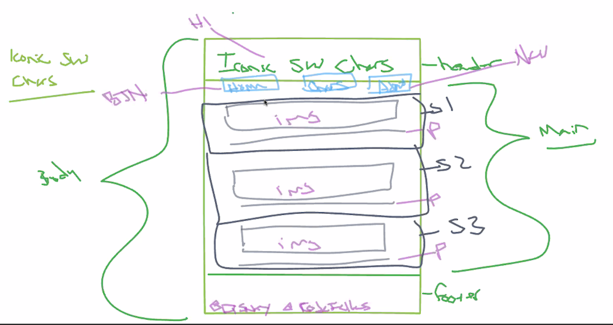

# Read: 04 - Structure web pages with HTML
**topics**
* Wire Frame
  * 
* Mozilla HTML Basics
* Semantics

## Wire Frame

screenshot of [Roger Huba](https://github.com/RogerHuba)'s example wire frame from lecture

### 

## Mozilla HTML Basics
### 

## Semantics
### 

 -**Git**: 
 
 -**GitHub**: Allows you to share your projects and code with the world 
 

back to [main page](README.md)