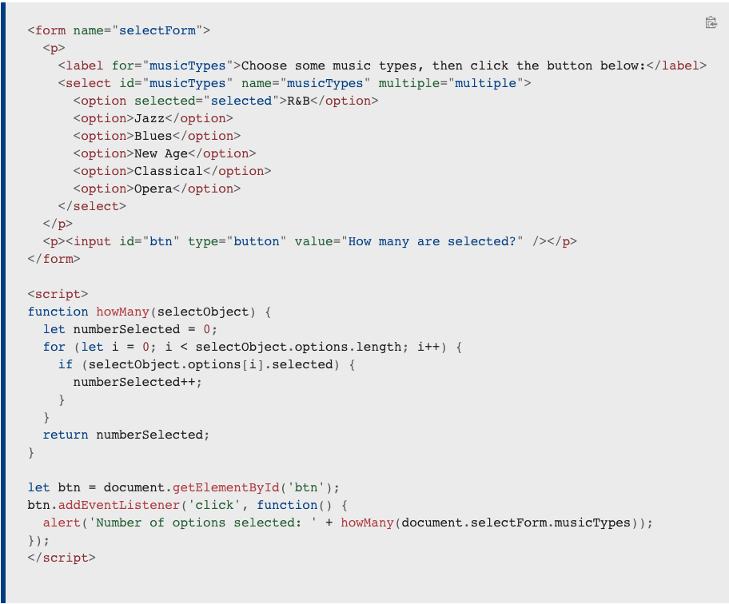
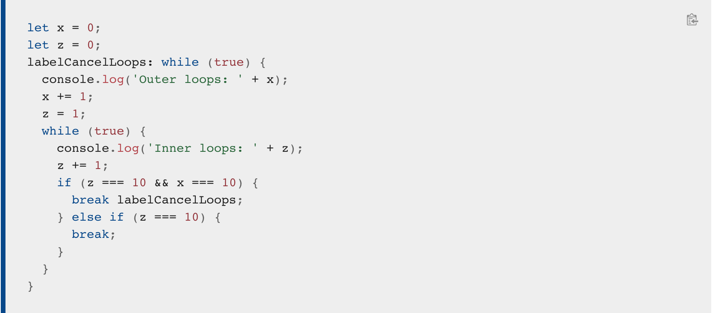

# Read: 08 - Operators and Loops

topics

* [Expressions and Operators](#expressions-and-operators)
* [Loops](#loops)

## [Expressions and Operators](https://developer.mozilla.org/en-US/docs/Web/JavaScript/Guide/Expressions_and_Operators)

Already have notes on [Programming with JavaScript](javascript-programming.md) page.

## Loops

**Loops** : offer a quick and easy way to do something repeatedly. There are many different kinds of loops, but they all essentially do the same thing: they repeat an action some number of times. (Note that it's possible that number could be zero!)

The various loop mechanisms offer different ways to determine the start and end points of the loop. The statements for loops provided in JavaScript are:

* for statement
* do...while statement
* while statement
* labeled statement
* break statement
* continue statement
* for...in statement
* for...of statement

### "for" statement

A for loop repeats until a specified condition evaluates to false. The JS "for" loop is similar to the Java and C "for" loop.

A for statement looks as follows:

>for ([initialExpression]; [conditionExpression]; [incrementExpression])
  statement

When a for loop executes, the following occurs:

1. The initializing expression initialExpression, if any, is executed. This expression usually initializes one or more loop counters, but the syntax allows an expression of any degree of complexity. This expression can also declare variables.
2. The conditionExpression expression is evaluated. If the value of conditionExpression is true, the loop statements execute. If the value of condition is false, the for loop terminates. (If the condition expression is omitted entirely, the condition is assumed to be true.)
3. The statement executes. To execute multiple statements, use a block statement ({ ... }) to group those statements.
4. If present, the update expression incrementExpression is executed.
5. Control returns to Step 2.

*ex. - In the example below, the function contains a for statement that counts the number of selected options in a scrolling list (a < select > element that allows multiple selections). The for statement declares the variable i and initializes it to 0. It checks that i is less than the number of options in the < select > element, performs the succeeding if statement, and increments i by after each pass through the loop.*

### "while" statement

A while statement executes its statements as long as a specified condition evaluates to true. A while statement looks as follows:

>while (condition)
> statement

If the condition becomes false, statement within the loop stops executing and control passes to the statement following the loop.

The condition test occurs before statement in the loop is executed. If the condition returns true, statement is executed and the condition is tested again. If the condition returns false, execution stops, and control is passed to the statement following while.

To execute multiple statements, use a block statement ({ ... }) to group those statements.

---

*ex. - The following while loop iterates as long as n is less than 3:*

>let n = 0;
>let x = 0;
>while (n < 3) {
> n++;
> x += n;
>}

*With each iteration, the loop increments n and adds that value to x. Therefore, x and n take on the following values:*

* *After the first pass: n = 1 and x = 1*
* *After the second pass: n = 2 and x = 3*
* *After the third pass: n = 3 and x = 6*

*After completing the third pass, the condition n < 3 is no longer true, so the loop terminates.*

---

*ex. 2 - Avoid infinite loops. Make sure the condition in a loop eventually becomes false—otherwise, the loop will never terminate! The statements in the following while loop execute forever because the condition never becomes false:*

>// Infinite loops are bad!
>while (true) {
> console.log('Hello, world!');
>}

### break statement

Use the break statement to terminate a loop, switch, or in conjunction with a labeled statement.

* When you use break without a label, it terminates the innermost enclosing *while*, *do-while*, *for*, or *switch* immediately and transfers control to the following statement.
* When you use break with a label, it terminates the specified labeled statement.

The syntax of the break statement looks like this:

>break;
>break [label];

1. The first form of the syntax terminates the innermost enclosing loop or switch.
2. The second form of the syntax terminates the specified enclosing labeled statement.

*ex.1 - The following example iterates through the elements in an array until it finds the index of an element whose value is theValue:*

>for (let i = 0; i < a.length; i++) {
> if (a[i] === theValue) {
> break;
> }
>}

*ex.2 - breaking to a label:*

back to [main page](README.md)